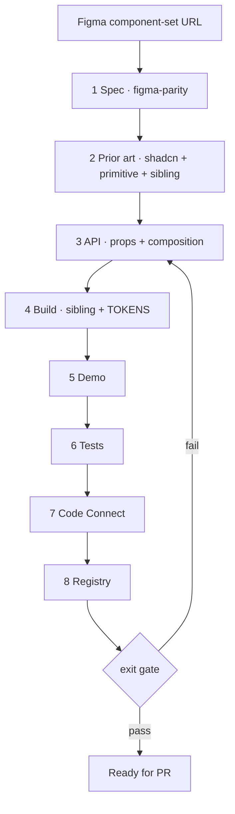

# Create a QBDS component

New component only. Updates → [figma-parity](../figma-parity/SKILL.md).

Owns **order**. Rules live in the linked docs — read them; do not invent parallel ones. When an eval asks for a step log, write `evals-out/steps.md` with **exactly eight lines** `1 Spec` … `8 Registry` (each once, in order). Append a line when that step finishes; never duplicate.

**Eval / hold-out:** If the component (or its tests / registry entry / Code Connect) was removed for the task, **implement it from fixtures + docs + siblings inside this worktree** — do **not** `git checkout` / restore deleted paths, do **not** read `public/r/<name>.json` as a source template, and do **not** copy from a parent checkout or other directories outside the worktree cwd.



## Steps

Each step's rules live in its linked doc. Read the doc; do not restate or extend it here.

1. **Spec** — [figma-parity](../figma-parity/SKILL.md), phases _Structure & variants_ → _Tokens_ → _Layout, spacing, typography & states_, run on the **component set**. Stop at the alignment table + variant × state matrix; that skill's visual pass needs a rendered demo, so it happens after step 5. No code. No URL → ask. Offline evals supply `evals-fixture/` instead of MCP.
2. **Prior art** — `npx shadcn@latest search|docs|view <name>`, the primitive's own docs (Base UI: `https://base-ui.com/react/components/<name>`), closest `src/components/ui/` sibling. Structure ← sibling, naming ← shadcn, behaviour ← primitive. Base UI vs Radix: [CLAUDE.md](../../../CLAUDE.md).
3. **API** — [props.md](../../../docs/components/props.md) (**how to choose**) + [composition.md](../../../docs/components/composition.md) (**how to compose**). Show the prop table and part list before building. Diverging from shadcn needs a one-line Figma reason.
4. **Build** — [build.md](../../../docs/components/build.md).
5. **Demo** — [demos.md](../../../docs/components/demos.md).
6. **Tests** — [tests.md](../../../docs/components/tests.md).
7. **Code Connect** — [code-connect](../code-connect/SKILL.md).
8. **Registry** — [registry.md](../../../docs/components/registry.md).

## Exit gate

Canonical for all component work — [figma-parity](../figma-parity/SKILL.md) defers to this.

```bash
npm run lint && npm run typecheck && npm run test:unit && npm run registry:build && npm run figma:parse
```

Ask before continuing when: a Figma axis has no sensible React expression, sibling contradicts shadcn naming, or a new token is needed.
