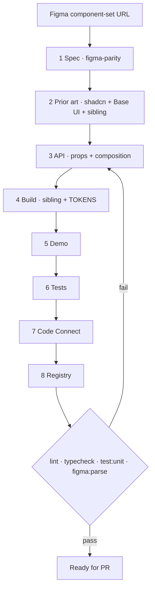

# Create a QBDS component

New component only. Updates → [figma-parity](../figma-parity/SKILL.md).

Owns **order**. Rules live in the linked docs — read them; do not invent parallel ones. When an eval asks for a step log, write `evals-out/steps.md` with **exactly eight lines** `1 Spec` … `8 Registry` (each once, in order). Append a line when that step finishes; never duplicate.

**Eval / hold-out:** If the component (or its tests / registry entry / Code Connect) was removed for the task, **implement it from fixtures + docs + siblings inside this worktree** — do **not** `git checkout` / restore deleted paths, do **not** read `public/r/<name>.json` as a source template, and do **not** copy from a parent checkout or other directories outside the worktree cwd.



## Steps

1. **Spec** — [figma-parity](../figma-parity/SKILL.md) steps 1–3 on the **component set**. Stop at alignment table + variant × state matrix. No code. No URL → ask. Offline evals may supply `evals-fixture/` instead of MCP.
   - When calling Figma MCP `get_design_context`, pass **`disableCodeConnect: true`**. Spec must come from Figma component description / axes / structure — **not** Code Connect snippets (they can be stale). Write Code Connect later in step 7.
2. **Prior art** — `npx shadcn@latest search|docs|view <name>`, Base UI at `https://base-ui.com/react/components/<name>`, closest `src/components/ui/` sibling. Prefer Base UI; Radix only if the sibling already uses it. Structure ← sibling, naming ← shadcn, behaviour ← primitive.
3. **API** — [props.md](../../../docs/components/props.md) (**how to choose**) + [composition.md](../../../docs/components/composition.md) (**how to compose**). Show prop table and part list before building. Diverging from shadcn needs a one-line Figma reason.
4. **Build** — `src/components/ui/<name>.tsx`. Tokens from [TOKENS.md](../../../docs/TOKENS.md). Match the **closest sibling's patterns** (cva vs `data-*` size attrs, `group/` naming, hit-area pseudos, export surface). Do not invent `render` / `nativeButton` wrappers unless the sibling or Base UI recipe in-repo does.
5. **Demo** — [demos.md](../../../docs/components/demos.md). Keep one-line `/** … */` docstrings; Label/Field chrome stays outside the leaf.
6. **Tests** — [tests.md](../../../docs/components/tests.md). Both blocks required: demo smoke (`exampleComponentMaps` + `Renderer`) and behaviour.
7. **Code Connect** — [code-connect](../code-connect/SKILL.md). Map Figma prop **types** faithfully (`getEnum` vs `getBoolean`). Compose labels with existing `Label` APIs (typography `className`, not invented `size` props).
8. **Registry** — [registry.md](../../../docs/components/registry.md) (**how to write**), then `npm run registry:build`. Only list npm deps you actually import.

## Gotchas (from eval diffs)

| Area                | Drift agents make                                                                                         | Fix                                                                                                                                  |
| ------------------- | --------------------------------------------------------------------------------------------------------- | ------------------------------------------------------------------------------------------------------------------------------------ |
| Build / Switch-like | Rewrite sizes with new `cva`, wrong thumb travel, wrong fill/stroke tokens, extra `nativeButton`/`render` | Copy structure from closest sibling; map sizes with `data-size` + Tailwind like Toggle/Switch peers; tokens from TOKENS + Figma vars |
| Build exports       | Export `*Variants` helpers that siblings do not                                                           | Export only what demos/consumers need (usually the root + documented parts)                                                          |
| Composition         | `showLeftLabel` / entry props on the control                                                              | Labels via `Label` + `htmlFor`/`id` outside the leaf                                                                                 |
| Demo                | Drop example docstrings; under-cover axes                                                                 | One `/** … */` per example; size + checked + disabled minimum for Switch                                                             |
| Tests               | Skip disabled→no-callback; skip `PointerEvent` polyfill                                                   | Assert change callbacks do not fire when `disabled`; polyfill when Base UI needs it                                                  |
| Code Connect        | Treat Figma `on`/`state` as booleans; invent `Label size=`                                                | Use `getEnum` where Figma is an enum; Label `className` typography + gap by size                                                     |
| Registry            | Add `class-variance-authority` without importing `cva`                                                    | Dependencies = imports in the ui file only                                                                                           |
| Eval integrity      | Restore from git / `public/r/*.json` / parent repo                                                        | Implement from `evals-fixture/` + docs + in-tree siblings only                                                                       |

## Exit gate

```bash
npm run lint && npm run typecheck && npm run test:unit && npm run figma:parse
```

Ask before continuing when: a Figma axis has no sensible React expression, sibling contradicts shadcn naming, or a new token is needed.
