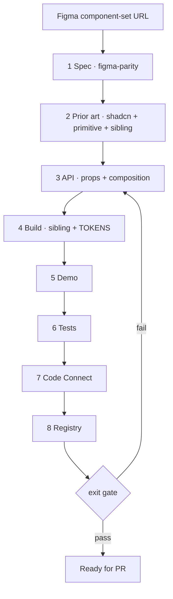

# Create a QBDS component

Add a new component from a Figma component-set URL. Your job is to walk eight steps in order — spec through registry — and pass the exit gate.

For updates to an existing component, use [figma-parity](../figma-parity/SKILL.md) instead.

Each step has its own doc in `docs/components/`. Read that doc at each step; don't invent parallel rules.



## Steps

1. **Spec** — [figma-parity](../figma-parity/SKILL.md): run _Structure & variants_ → _Tokens_ → _Layout, spacing, typography & states_ on the **component set**. Stop at the alignment table + variant × state matrix; the visual pass happens after step 5 when a demo exists. No code yet. No URL → ask.
2. **Prior art** — Look up shadcn (`npx shadcn@latest search|docs|view <name>`), the primitive docs (Base UI: `https://base-ui.com/react/components/<name>`), and the closest sibling in `src/components/ui/`. Structure from the sibling, naming from shadcn, behaviour from the primitive. Base UI vs Radix: [CLAUDE.md](../../../CLAUDE.md).
3. **API** — [props.md](../../../docs/components/props.md) + [composition.md](../../../docs/components/composition.md). Show the prop table and part list before building. Diverging from shadcn needs a one-line Figma reason.
4. **Build** — [build.md](../../../docs/components/build.md).
5. **Demo** — [demos.md](../../../docs/components/demos.md).
6. **Tests** — [tests.md](../../../docs/components/tests.md).
7. **Code Connect** — [code-connect](../code-connect/SKILL.md).
8. **Registry** — [registry.md](../../../docs/components/registry.md).

## Exit gate

Canonical for all component work — [figma-parity](../figma-parity/SKILL.md) defers to this.

```bash
npm run lint && npm run typecheck && npm run test:unit && npm run registry:build && npm run figma:parse
```

Ask before continuing when: a Figma axis has no sensible React expression, sibling contradicts shadcn naming, or a new token is needed.
