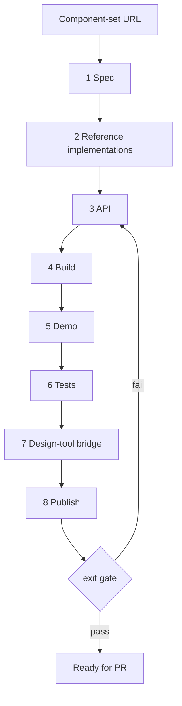

# Design tool → component library

Generic layer — the single home for these rules. In QBDS, [create-qbds-component](../create-qbds-component/SKILL.md) binds them to real paths, tokens, primitive and exit gate; start there for QBDS work.

Turn a design-tool component set into a shippable library component. Your job is to walk eight steps in order — spec through publish — and pass the host exit gate.

For updates to an existing component, use the host's parity/review skill instead.

## Steps

1. **Spec** — Read the component set before writing code. Build an alignment table (design axes ↔ React props) and a variant × state matrix. Stop before implementation; the visual pass needs a rendered demo (step 5). No URL → ask.

2. **Reference implementations** — Look up the nearest library recipe, the headless primitive docs, and the closest sibling in the host repo. Structure from the sibling, naming from the library convention, behaviour from the primitive.

3. **API** — Decide props and composition from the alignment table. Show the prop table and part list before building.
   - Prefer library prop names over design-tool property names.
   - Map `show*` booleans and slot instances to children or named parts — not new props.
   - Skip a public `state="…"` enum; interaction states belong in CSS and data attributes.
   - Design-tool style axis → `variant`; size axis → `size`.
   - Shared axes (`size`, `variant`, …) → root props or context; parts read them.
   - Dismiss and actions → a part plus callback, not a show boolean.
   - Group frames in the design file → demo composition only, not a leaf prop.

4. **Build** — Implement the component file using the host styling system and tokens. Geometry comes from the variant × state matrix, not from primitive defaults.

5. **Demo** — Prove every design variant in the host demo registry.
   - First example = simplest usable form; one example per axis.
   - Cover every row in the alignment table.

6. **Tests** — Functional smoke plus behaviour; not pixel-perfect styling.
   - Demo smoke: render every demo example without crashing.
   - Behaviour: click, disabled, remove, data attributes as needed.
   - Assert roles, aria, callbacks.
   - Skip CSS classes, colours, variant-helper output, keyboard matrices.

7. **Design-tool bridge** — Wire the component set to code snippets in the design tool (Code Connect, Storybook stories, etc.) using the host's bridge skill.

8. **Publish** — Add a registry or package entry so consumers can install the component. Run the host publish/build step.

## Host bindings

A host repo fills these slots — see its binding skill (e.g. `create-qbds-component`):

| Slot              | What the host provides                      |
| ----------------- | ------------------------------------------- |
| Component path    | Where the `.tsx` file lives                 |
| Demo path         | Where demo examples live                    |
| Test path         | Where tests live                            |
| Primitive library | Headless UI layer and migration state       |
| Styling system    | Tokens, utilities, variant helpers          |
| Publish mechanism | Registry, package, or docs build            |
| Exit gate         | Lint, typecheck, test, and publish commands |

Ask before continuing when: a design axis has no sensible React expression, the sibling contradicts library naming, or a new token is needed.
