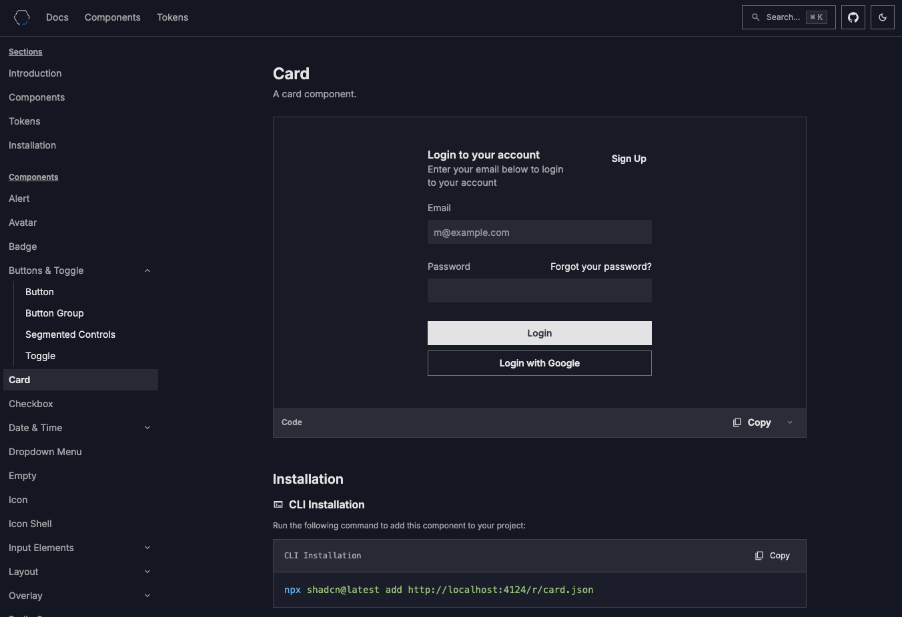

# QuantumBlack Design System

QuantumBlack Design System is a set of accessible components built with [Radix UI](https://www.radix-ui.com/) and styled with design tokens. Components are distributed through a [shadcn](https://ui.shadcn.com/) registry as source files—not as an NPM package.

Most component libraries are installed as NPM packages — you import what the package exports and customize through wrappers or style overrides when you need something different. Here, components are added to your project as source files through a [shadcn](https://ui.shadcn.com/) registry. You own the code, install only what you need, and can use components as-is or modify them directly.

**Open sourced** under the [Apache License 2.0](LICENSE.txt). Copyright McKinsey & Company.

## Install components in your project

Use the hosted documentation site to browse the registry, follow installation steps, and reference design tokens:

<p align="center">
  <a href="https://designsystem.quantumblack.com">
    
  </a>
  <br />
  <a href="https://designsystem.quantumblack.com"><sub>designsystem.quantumblack.com</sub></a>
</p>

## Run the registry locally

This repository contains the registry site and component source.

1. Clone the repository.
2. Install dependencies and start the dev server:

   ```bash
   npm install
   npm run dev
   ```

3. Open [http://localhost:4123](http://localhost:4123).

`npm run dev` rebuilds the registry before starting the server. To rebuild registry files without starting the server, run:

```bash
npm run registry:build
```

For prerequisites, environment setup, and adding components, see the [contributing guide](CONTRIBUTING.md).

## Contribute

Contributions welcome. Before opening an issue or pull request, read the [Code of Conduct](CODE_OF_CONDUCT.md) and [security policy](SECURITY.md).

## License

Licensed under the Apache License, Version 2.0. See [LICENSE.txt](LICENSE.txt) for the full text.
