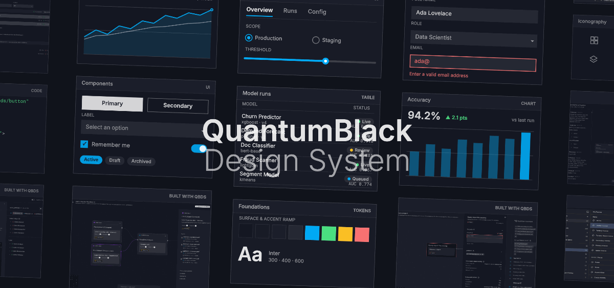

# QuantumBlack Design System

<p align="center">
  <a href="https://designsystem.quantumblack.com">
    
  </a>
  <br />
  <a href="https://designsystem.quantumblack.com">designsystem.quantumblack.com</a>
</p>
  
  
QuantumBlack Design System provides accessible components built with [Base UI](https://base-ui.com/) and [Radix UI](https://www.radix-ui.com/) primitives and styled with design tokens. You add them to your project as source files through the [shadcn](https://ui.shadcn.com/) registry, not as an NPM package.

Unlike a typical component library, where you install a package and import what it exports, QBDS copies the component files directly into your project. You install only what you need, and can use components unchanged, or edit them directly. With QBDS, there is no need for wrappers, overrides, or working around what the library gives you.

**Open sourced** under the [Apache License 2.0](LICENSE.txt). Copyright McKinsey & Company.

## Get started

Head to the [documentation](https://designsystem.quantumblack.com/) to browse components, follow the installation guide, and look up design tokens:

<p align="center">
  <a href="https://designsystem.quantumblack.com">
    
  </a>
  <br />
  <a href="https://designsystem.quantumblack.com">designsystem.quantumblack.com</a>
</p>

## Run the registry locally

This repository contains the registry site and component source.

1. Clone the repository
2. Install dependencies and start the dev server:

   ```bash
   npm install
   npm run dev
   ```

3. Open [http://localhost:4123](http://localhost:4123).

   `npm run dev` rebuilds the registry before starting the server. To rebuild registry files without starting the server, run:

   ```bash
   npm run registry:build
   ```

   For prerequisites, environment setup, and adding components, see the [contributing guide](CONTRIBUTING.md).

## Contribute

Contributions welcome. Before opening an issue or pull request, read the [Code of Conduct](CODE_OF_CONDUCT.md) and [security policy](SECURITY.md).

## Report a security vulnerability

Security is very important for QuantumBlack Design System and its community.
Find out how to submit a report from [SECURITY.md](./SECURITY.md).

## License

Licensed under the Apache License, Version 2.0. See [LICENSE.txt](LICENSE.txt) for the full text.
